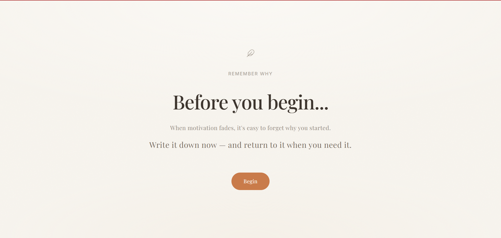
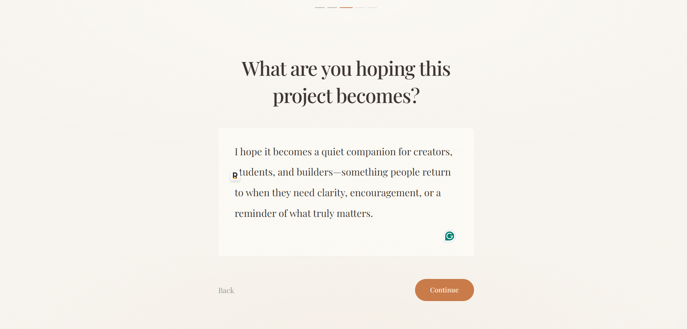
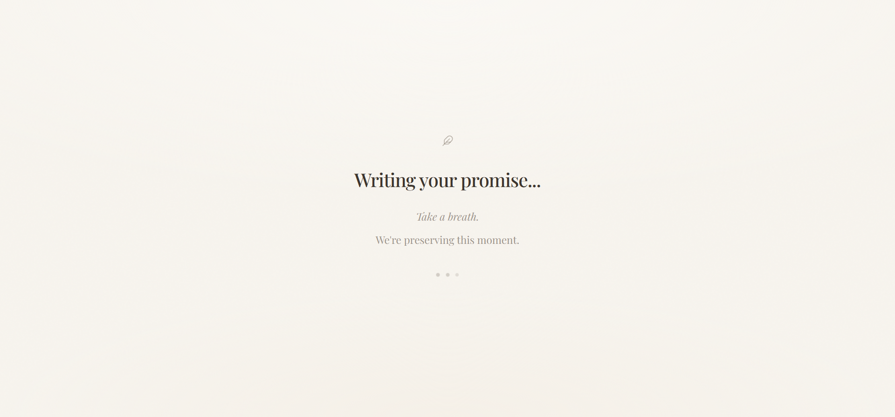
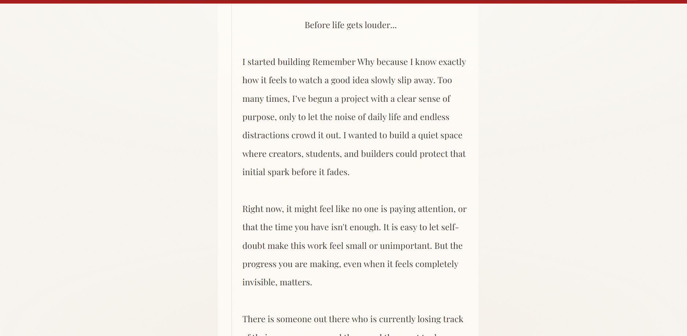
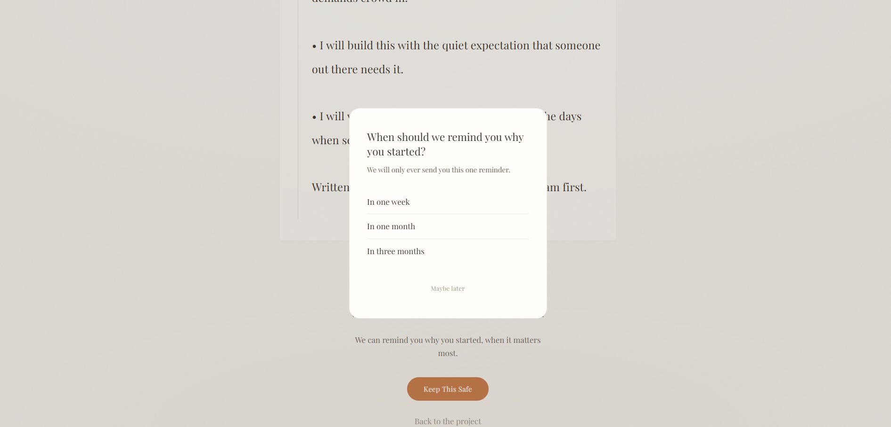

<p align="center">
  
</p>

<h1 align="center">Remember Why</h1>

<p align="center"><em>Don't just start. Remember why.</em></p>

<p align="center">
  <a href="https://laravel.com"></a>
  <a href="https://ai.google.dev/"></a>
  <a href="https://resend.com"></a>
  <a href="LICENSE"></a>
</p>

<p align="center">
  Write down why you started — then return to your own words when motivation fades.
</p>

<!-- Banner image -->
<!-- <p align="center"></p> -->

<!-- Demo GIF -->
<!-- <p align="center"></p> -->

---

## The Problem

Most passion projects don't fail because of a lack of talent.

They fail because life gets louder.

Work. Study. Responsibilities. Deadlines. The noise of everyday life slowly replaces the clarity you had on day one.

Eventually, we forget why we started.

Not because we stopped caring — but because we stopped remembering.

---

## The Solution

Remember Why is a quiet ritual for the moments before you begin.

The application asks five thoughtful questions about what you're building and why it matters. Your answers are transformed by Gemini into a deeply personal promise — written in your voice, shaped from your own words.

You seal it. You choose when to receive a reminder. And months later, when motivation fades and life gets louder again, Remember Why quietly returns that promise to you.

No dashboards. No productivity metrics. Just a letter from your past self, waiting for the moment you need it most.

---

## Why I Built This

I've used plenty of tools to plan projects, track tasks, and stay organized. None of them helped me remember why any of it mattered.

When motivation faded, I didn't need another dashboard. I needed to hear from the version of me that still believed.

Remember Why is what I wished existed — a quiet place to leave a promise for your future self, and find it again when it matters.

---

## User Journey

```
Start Project
      ↓
Answer Five Questions
      ↓
Generate Promise
      ↓
Seal It
      ↓
Choose Reminder
      ↓
Receive It Later
      ↓
Reconnect With Your Why
```

---

## Features

- [x] **Five reflective questions** — Articulate what matters before the hard part begins
- [x] **A personal promise** — Your words, shaped into a letter — not a motivational quote
- [x] **Seal and keep** — A small, intentional act of commitment
- [x] **A single reminder** — One week, one month, or three months. One email. Nothing more
- [x] **Welcome back** — Returning feels like opening something personal
- [x] **Editorial design** — Typography and pacing that feel like a keepsake

---

## Why AI?

Gemini is not here to replace your creativity.

It is here to listen.

Remember Why uses AI to reorganize your own words — preserving your voice while giving them the shape of a promise you will want to read again. The model does not invent your motivation. It reflects it back to you, carefully.

The goal is remembrance, not motivation.

You already know why you started. Remember Why helps you hold onto that.

---

## Tech Stack

| Layer | Technology |
|-------|------------|
| Framework | Laravel 12 |
| Views | Blade |
| Styling | Tailwind CSS |
| Database | SQLite |
| AI | Gemini API |
| Email | Resend |
| Scheduling | Laravel Scheduler |

---

## Architecture

```
  Browser
     │
     ▼
  Laravel ──────────► Gemini API
     │
     ▼
  SQLite
     │
     ▼
  Scheduler ────────► Resend
```

Laravel orchestrates the conversation, generation, and sealing. Gemini shapes your reflections into a promise. SQLite stores it privately. The scheduler delivers one thoughtful email through Resend — when the time comes.

---

## Screenshots

<p align="center"><em>Screenshots coming soon.</em></p>

| Welcome | Conversation |
|:---:|:---:|
|  |  |
| *Before you begin* | *Five thoughtful questions* |

| Reflection | Promise |
|:---:|:---:|
|  |  |
| *Your promise takes shape* | *A letter from your past self* |

<p align="center">
  
  <br />
  <em>One quiet email, when you need it</em>
</p>

---

## Local Installation

**Requirements:** PHP 8.2+, Composer, Node.js 18+

```bash
# Clone the repository
git clone https://github.com/your-username/remember-why.git
cd remember-why

# Install dependencies
composer install
npm install

# Configure environment
cp .env.example .env
php artisan key:generate

# Create the database
touch database/database.sqlite

# Run migrations
php artisan migrate

# Build frontend assets
npm run build

# Start the application
php artisan serve
```

Visit `http://localhost:8000` in your browser.

To test reminders locally, run the scheduler in a separate terminal:

```bash
php artisan schedule:work
```

---

## Environment Variables

Add the following to your `.env` file:

```env
GEMINI_API_KEY=your_gemini_api_key
RESEND_API_KEY=your_resend_api_key
MAIL_MAILER=resend
MAIL_FROM_ADDRESS=hello@yourdomain.com
MAIL_FROM_NAME="Remember Why"
```

| Variable | Purpose |
|----------|---------|
| `GEMINI_API_KEY` | Powers promise generation from your reflections |
| `RESEND_API_KEY` | Sends reminder emails when the time comes |
| `MAIL_MAILER` | Set to `resend` for production; use `log` during local development |

Never commit real API keys to version control.

---

## Roadmap

- Multiple reminders
- Mobile experience
- Promise history
- Journal mode

---

## Built During

Remember Why was built during the **DEV Weekend Challenge — Passion Edition**.

A weekend to make something personal — and put it into the world.

---

## License

This project is open-sourced software licensed under the [MIT license](https://opensource.org/licenses/MIT).
